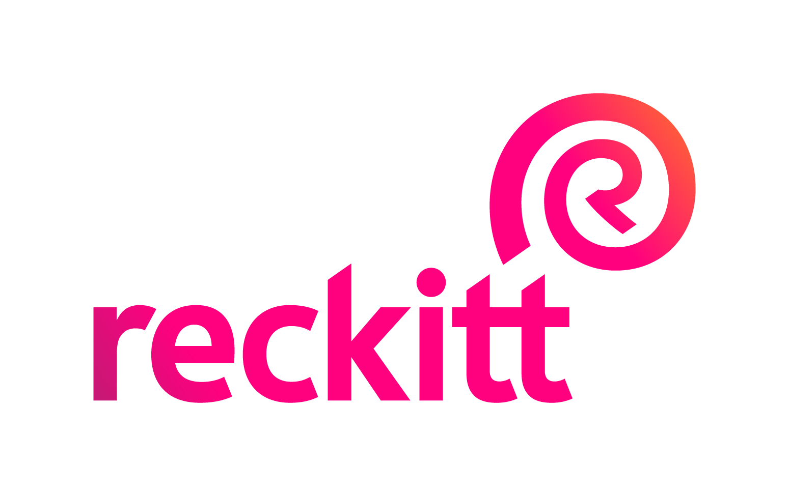
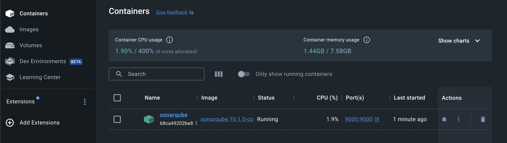
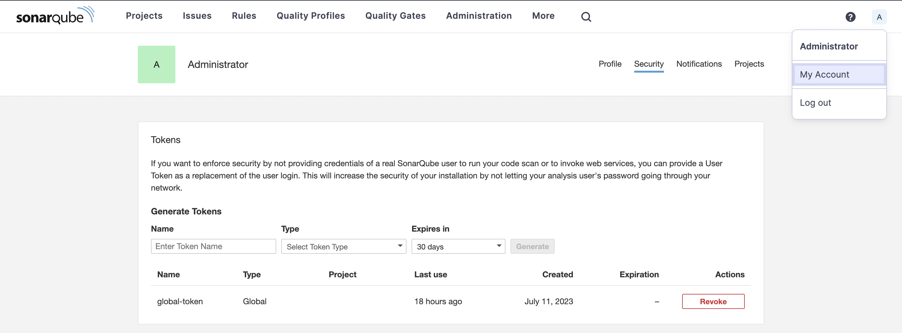
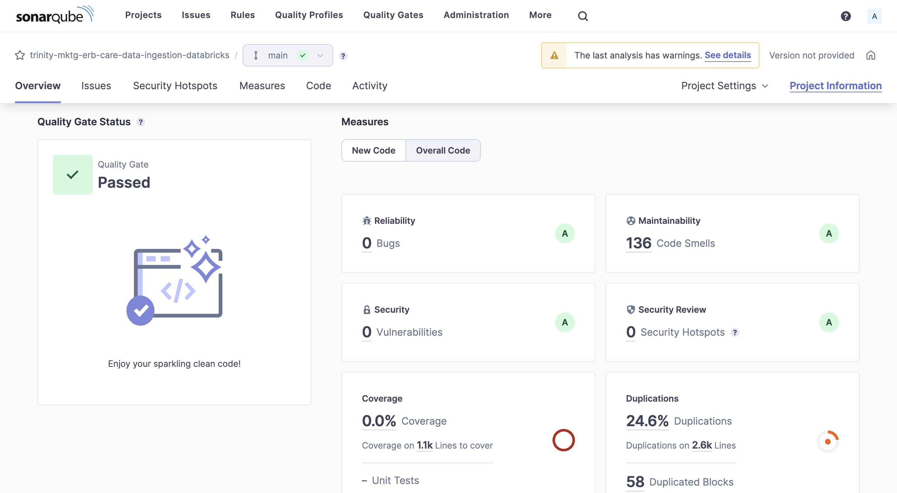

# rb-trinityintelliview-airflow



<!-- TABLE OF CONTENTS -->
<details open>
    <summary>Table of Contents</summary>

1. [Introduction](#introduction)
    - [Technologies and Tools Used](#technologies-and-tools-used)
2. [Getting Started](#getting-started)
    - [Ruff and SonarQube Integration Guide](#ruff-and-sonarqube-integration-guide)
        - [Overview](#overview)
        - [Installation and Setup](#installation-and-setup)
            - [Ruff](#ruff)
            - [SonarQube](#sonarqube)
        - [Troubleshooting](#troubleshooting)
3. [Project Structure](#project-structure)
4. [Testing](#testing)
5. [Developer Checklist](#developer-checklist)
   - [Commit Checklist](#commit-checklist)
   - [PR Checklist](#pr-checklist)
6. [Documentation](#documentation)
   - [DAG Generator and Builder](#dag-generator-and-builder)
   - [From Local to Cloud: Deploying Your DAG on Google Composer](#from-local-to-cloud-deploying-your-dag-on-google-composer)
      - [Creating an Extraction Pipeline](#creating-an-extraction-pipeline)
      - [Creating a Main Pipeline](#creating-a-main-pipeline)
      - [Generating the Main DAG](#generating-the-main-dag)
      - [Deploying the DAGs to GCP Composer](#deploying-the-dags-to-gcp-composer)
   - [Archive to Landing](#archive-to-landing)

</details>

<!-- MARKDOWN LINKS & IMAGES -->
<!-- https://www.markdownguide.org/basic-syntax/#reference-style-links -->

[Python]: https://img.shields.io/badge/Python-20232A?style=for-the-badge&logo=python&logoColor=ffde57
[Python-url]: https://python.org/

[AIRFLOW]: https://img.shields.io/badge/Airflow-20232A?style=for-the-badge&logo=apacheairflow&logoColor=FFFFFF
[Airflow-url]: https://airflow.apache.org/
[Yaml]: https://img.shields.io/badge/Yaml-20232A?style=for-the-badge&logo=yaml&logoColor=CB171E
[Yaml-url]: https://yaml.org/

[AzureDevOps]: https://img.shields.io/badge/Azure%20DevOps-20232A?style=for-the-badge&logo=azure-devops&logoColor=0078D7
[AzureDevOps-url]: https://azure.microsoft.com/en-in/products/devops

[Git]: https://img.shields.io/badge/Git-20232A?style=for-the-badge&logo=git&logoColor=F05032
[Git-url]: https://git-scm.com/

[Black]: https://img.shields.io/badge/Black-20232A?style=for-the-badge&logo=&logoColor=3775A9
[Black-url]: https://black.readthedocs.io/

[Ruff]: https://img.shields.io/badge/Ruff-20232A?style=for-the-badge&logo=ruff&logoColor=FCC21B
[Ruff-url]: https://beta.ruff.rs/docs/

[Radon]: https://img.shields.io/badge/Radon-20232A?style=for-the-badge&logo=radon&logoColor=FCC21B
[Radon-url]: https://radon.readthedocs.io/en/latest/

[SonarQube]: https://img.shields.io/badge/SonarQube-20232A?style=for-the-badge&logo=sonarqube&logoColor=4E9BCD
[SonarQube-url]: https://www.sonarsource.com/products/sonarqube/

# Introduction

This project is reponsible for orchestrating the databricks workflows for reckitt-intelliview project.

## Technologies and Tools Used

**Workflow Orchestration:**

[![Airflow][Airflow]][Airflow-url]

**Project Management and Version Control:**

[![AzureDevOps][AzureDevOps]][AzureDevOps-url]
[![Git][Git]][Git-url]

**Programming Language & Configuration:**

[![Python][Python]][Python-url]
[![Yaml][Yaml]][Yaml-url]

**Code Quality and Formatting:**

[![Black][Black]][Black-url]
[![Ruff][Ruff]][Ruff-url]
[![Radon][Radon]][Radon-url]
[![SonarQube][SonarQube]][SonarQube-url]

# Getting Started

Before you begin, ensure that you have the following prerequisites installed:

- [Airflow](https://airflow.apache.org/)[TODO]: Set up Airflow locally for faster development and troubleshooting if the DAG does not appear as expected in the UI.
   - Dev Airflow intelliview sandbox - [intelliv2-sbx-composer-euw2-f880](https://console.cloud.google.com/composer/environments?authuser=0&project=group-intelliv2-dev-euw2)</br>

- [Visual Studio Code](https://code.visualstudio.com/): IDE (Integrated Development Environment).

- [Git](https://git-scm.com/): Install Git version control system to manage the project's source code and collaborate with other developers.

- [Python](https://www.python.org/): Ensure Python is installed on your system. The project is compatible with Python 3.7 or higher.

- [Black](https://black.readthedocs.io/): Install black code formatter for Python to ensure consistent code style and formatting.
If not installed you can install with below command:

    ```bash
    pip install black
    ```

- [Radon](https://radon.readthedocs.io/en/latest/): Radon is a Python tool which computes various code metrics.
If not installed you can install with below command:

    ```bash
    pip install radon
    ```

## Ruff and SonarQube Integration Guide

This guide helps developers use Ruff and SonarQube to improve code quality, follow best practices, and maintain consistent development practices.

## Overview

SonarQube analyzes code, gives feedback, and improves code quality. Integrate it to catch issues, enforce standards, and maintain high-quality code.

## Installation and Setup

Before using Ruff and SonarQube, you need to set up the necessary components. Follow the steps below:

### Ruff

- Install Ruff using pip:
    ```bash
    pip install ruff
    ```

- Ruff can also be used as a [VS Code extension](https://marketplace.visualstudio.com/items?itemName=charliermarsh.ruff) or alongside any other editor through the [Ruff LSP](https://github.com/astral-sh/ruff-lsp).

**To enable ruff & black on autosave in VS Code IDE**

- Download [Black Formatter](https://marketplace.visualstudio.com/items?itemName=ms-python.black-formatter) & [Ruff](https://marketplace.visualstudio.com/items?itemName=charliermarsh.ruff) extension.
- Open your command pallete `(shift + cmd + P)`
  - Enter settings and click on `Preferences: Open User Settings (JSON)`
  - And add below block of code:

    ```bash
    "[python]": {
        "editor.formatOnType": true,
        "editor.defaultFormatter": "ms-python.black-formatter",
        "editor.formatOnSave": true,
        "editor.codeActionsOnSave": {
            "source.organizeImports.ruff": true
        },
    },
    ```

  - Adding this will autoformat your file while saving.

### SonarQube

1. Download [Docker](https://www.docker.com/products/docker-desktop/) for your system.
2. Find the Community Edition Docker image on [Docker hub](https://hub.docker.com/_/sonarqube/). And run below command replacing with the latest community edition you find above. As of writing this documentation, the most recent version available was `10.1.0-community`.

    ```bash
    docker pull sonarqube:10.1.0-community
    ```

### Sonar Scanner

1. Install [brew](https://brew.sh/) if not already

    ```bash
    /bin/bash -c "$(curl -fsSL https://raw.githubusercontent.com/Homebrew/install/HEAD/install.sh)"
    ```

2. Install Sonar-Scanner

    ```bash
    brew install sonar-scanner
    ```

## Using SonarQube

SonarQube is used for code analysis at a larger scale and can be integrated into your development workflow. Follow these steps to analyze your project using SonarQube:

1. Start the SonarQube server by launching the Docker container.

2. Take note of the port number in the "Port" column. To access your SonarQube server, open [http://localhost:{port}/](http://localhost:9000/) in your browser, replacing {port} with the actual number.

3. Generate a global token by naviagting to `My Account > Security`. You can set the expiration to "No expiry".


4. Set up the SONAR_TOKEN environment variable in either your `bash_profile` or `zshrc`, depending on your preferred shell.

    - Add the following line to the respective file: (provide token without quotes)

        ```bash
        export SONAR_TOKEN="SONAR_TOKEN"
        ```

5. To create your SonarQube project, click "Create Project" and choose "Manually." **Enter the project display name and key, ensuring they match your repository's name.**

6. In the `New Code` section, choose `Reference Branch` and click `Create Project`.

7. Open a terminal, navigate to the root directory of your repository, and run the following command:

    ```bash
    sonar-scanner
    ```

8. Within a few seconds, you should see a dashboard similar to the one below on the port where SonarQube is running:

<br></br>

## Troubleshooting

If you encounter any issues while using SonarQube, refer to the [troubleshooting section](https://docs.sonarsource.com/sonarqube/latest/setup-and-upgrade/troubleshooting/) in the [official documentation](https://docs.sonarsource.com/sonarqube/latest/) or [community forums](https://community.sonarsource.com/). The documentation usually provides solutions to common problems and workarounds for known issues.
<br></br>

# Project Structure

TODO: Provide an overview of the project's directory structure and explain the purpose of each major directory or file.
<br></br>

# Testing

TODO: Describe how to run the tests for the project and any testing frameworks or libraries used.
<br></br>

# Developer Checklist

Before creating a pull request, make sure to go through the following checklist:

## Commit Checklist

Before committing your changes to the repository, ensure that you have completed the following steps:

- **Code Formatting**: Verify that your code follows this project's coding style and formatting guidelines. Use tools like `Black` and `Ruff` to format your code consistently.
- **Code Quality**: Use `Ruff` & `Sonarqube` to minimize warnings and ensure code quality while in development.
- **Generate Report**:

    ```bash
    python generate_report.py
    ```

    By default, the command generates a report for files modified relative to the 'main' branch. If you want to generate a report relative to another branch (typically the branch you're raising a PR for), specify the target branch name.

    ```bash
    python generate_report.py dev
    ```

## PR Checklist

While creating a pull request, ensure the following checklist:

- **Include URL of Successful Job Runs**: Add the URL(s) of successful job runs or relevant test runs used for testing your changes.
- **Attach SonarQube Report**: Attach screenshot of SonarQube report to PR.
- **Attach User Story/Work Items**: Attach the user story or work item for which this pull request is raised, providing context and traceability.
- **Assign Peer Reviewer**: Add your assigned peer of the sprint as an optional reviewer on the PR.
<br></br>

# Documentation

## DAG Generator and Builder

This guide provides step-by-step instructions on how to use the DAG generator and builder for creating and deploying pipelines.

## From Local to Cloud: Deploying Your DAG on Google Composer

If not already installed, ensure that you install gcloud, which will be utilized to transfer your local file to the Google Cloud bucket.

### Creating an Extraction Pipeline

To create an extraction pipeline for a datasource, follow these steps:

1. Create a new Python file for the datasource extraction inside the directory `dags/datasource/`. For example, if the datasource name is `adverity`, and your data product is `intelliview`, then create a file named `intelliview_adverity_extraction.py` inside the directory `dags/intelliview_adverity/`.
2. Implement the extraction logic for the datasource in the newly created file.

### Creating a Main Pipeline

To create a main pipeline for a datasource, follow these steps:

1. Create a config YAML file for the datasource inside the directory `dag_generator/config/`. For example, if the datasource name is `adverity`, and your data product is `intelliview`, create a file named `intelliview_adverity.yaml` inside the directory `dag_generator/config/`.
2. Specify the following parameters in the config YAML file:
   - `datasource_id`: The unique identifier for the datasource.
   - `data_product`: For e.g. `intelliview`
   - `schedule`: The schedule at which the pipeline should run. For example, `@daily`.

   Example adverity.yaml

   ```yaml
   datasource_id: ga
   data_product: intelliview
   schedule: '@daily'
   ```

3. If required, add any additional config parameters to the config YAML file. The config params must start with `extraction` to be detected by `generator.py`

   Example ga.yaml with config params

   ```yaml
   datasource_id: abcd
   data_product: intelliview
   schedule: '@daily'
   extraction_acquisition_type: "incremental"
   extraction_var1: "value1"
   extraction_var2: "value2"
   ```

   You could utilize these configuration parameters in your extraction DAG as demonstrated below:

   ```python
   def get_conf(context):
      my_config = context['dag_run'].conf['var1']
      return (f"config: {my_config}")

   @task(task_id="extract", retries=0)
   def extract_fun(**context):
      print(get_conf(context))
      return "243"
   ```

### Generating the Main DAG

To generate the main DAG for the datasource, run the following command:

`python dag_generator/generator.py`

Note: Upon completing this step, the data_product_datasource_main.py files ought to be generated within the dags/data_product_datasource/ directory.

### Deploying the DAGs to GCP Composer

To deploy the DAGs to GCP Composer, follow these steps:

1. Run the following command to deploy all the datasources:

   For dev: `python builder.py dev`

   For prod: `python builder.py prod`

   - Alternatively, you can deploy only a specific datasource by running the following command:

      `python builder.py dev --source intelliview_adverity`

   - You can also include the Trinity package while deploying by running the following command:

      `python builder.py dev --source intelliview_adverity --include_trinity`

2. Finally to deploy to the composer run:
   `sh ./builds/dags/deploy.sh`

# Archive to Landing
If you want to transfer data from the archive bucket to the landing bucket at your convenience, you may manually initiate the archive_to_landing pipeline. The configuration can be provided in the following format:

```
{
    "platform_id": "platform",
    "table_id": "table_id",
    "acquisition_start_date": "yyyy-mm-dd",
    "acquisition_end_date": "yyyy-mm-dd"
}
```

`platform_id`: options include the id of the platforms e.g. 'amazon_dsp', 'cm360', 'dv360' etc.
`table_id`: e.g., 'ads_daily' belongs to the 'cm360' platform_id
`acquisition_start_date`: indicates the start date from which you wish to transfer data
`acquisition_end_date` (optional): if provided, indicates the end date until which you want to get data; defaults to the acquisition_start_date if not specified.
